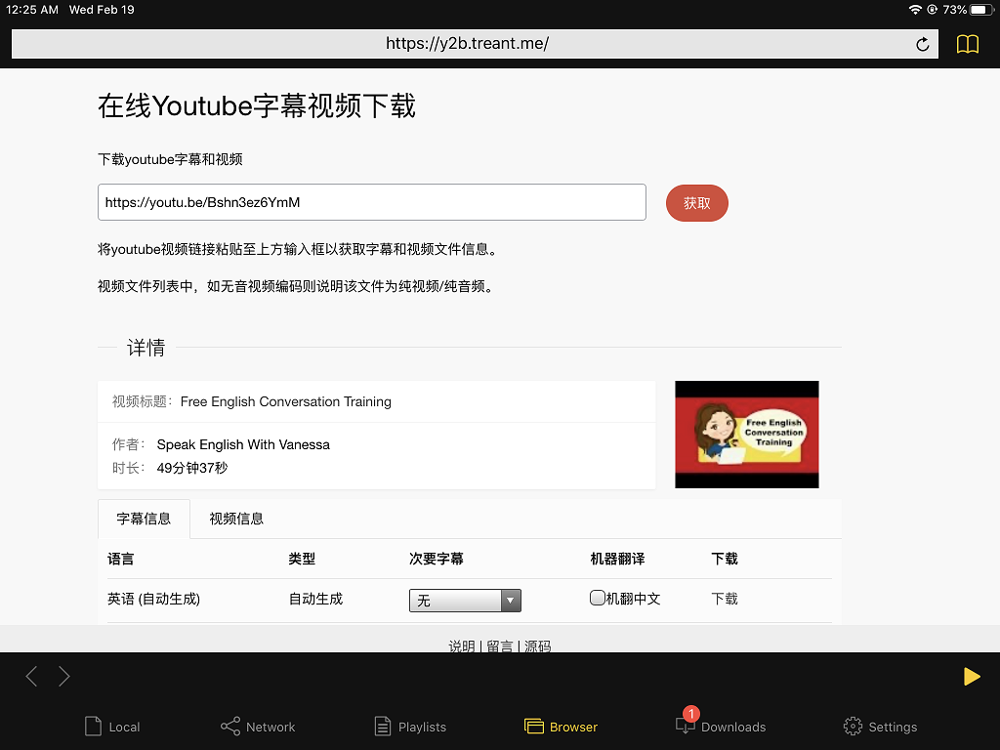

# ytvc


--- 
用于下载youtube字幕和视频的一个web应用。[访问地址](https://y2b.treant.me)

开发目的是为了解决我在ipad上下载youtube字幕和视频的需求。
（pc可以使用chrome插件/油猴脚本/youtube-dl/annie等方式下载youtube视频，但是ipad上不能这样）
可以在pc上运行服务，然后ipad通过局域网访问。
配合nPlayer使用，可以比较方便地下载字幕和视频。



---

### 运行
默认端口8080
```bash
    git clone https://github.com/treant5612/ytvc-web.git
    cd ytvc-web
    go build
    ./ytvc-web
```
如需代理，使用
```bash
    https_proxy=ip:port ./ytvc-web 
```

使用了redis暂存数据，无redis会重复访问youtube视频页面获取数据，不影响功能。
